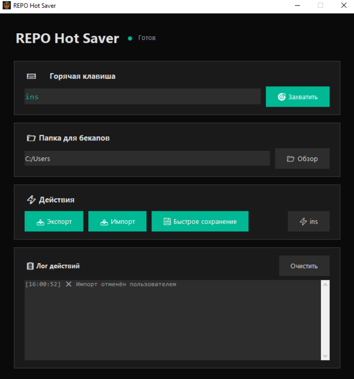

# 🎮 REPO Hot Saver

  

  <b>Удобный инструмент для быстрого сохранения и восстановления миров в R.E.P.O.</b>

  
  
  
  

---

## 📖 О программе

**REPO Hot Saver** — это лёгкое приложение с современным тёмным интерфейсом, созданное для удобного управления сохранениями в игре **R.E.P.O.** Больше не нужно вручную лазить по папкам `AppData` — всё делается в один клик или по горячей клавише.

### ✨ Основные возможности

- ⌨️ **Настраиваемая горячая клавиша** — захват любой клавиши (Insert, Home, F1-F12, Ctrl+Shift+S и др.)
- 💾 **Мгновенное сохранение** — копирование всех миров в выбранную папку одним нажатием
- 📥 **Экспорт** — создание бекапа с датой в имени
- 📤 **Импорт** — быстрое восстановление миров из бекапа
- 📁 **Выбор папки** — куда сохранять и откуда восстанавливать
- 🌙 **Современный интерфейс** с зелёными акцентами
- 📋 **Лог действий** — все операции видны в реальном времени
- 🔄 **Работа в фоне** *(только в v2.0)* — сворачивание в трей, приложение продолжает работать

---

### Особенности

- 🖥️ **Работа в системном трее** — приложение можно свернуть и оно продолжит работать в фоне
- 📋 **Контекстное меню в трее:**
  - 📂 **Открыть** — развернуть окно обратно
  - 💾 **Быстрое сохранение** — сделать бекап прямо из трея
  - ❌ **Закрыть** — полностью выйти из программы
- ⌨️ **Горячая клавиша работает в фоне** — даже когда окно скрыто, вы можете делать бекапы по нажатию клавиши
- 🚫 **Защита от дублирования** *(v3.0)* — повторный запуск разворачивает уже открытую программу

**Как работает:**
1. Нажмите **`X`** на окне → программа свернётся в трей
2. Окно исчезает из панели задач, но остаётся в трее
3. Правый клик по иконке в трее → откроется меню
4. **"Открыть"** — вернуть окно, **"Закрыть"** — выключить программу

---

## 🚀 Установка

1. Скачайте `RepoHotSaver.exe` из [последнего релиза](https://github.com/0ptim1st-DK/REPO-HotSaver/releases/latest) или [здесь]()
2. Запустите файл (можно из любого места)
3. Готово! Программа работает без установки Python
